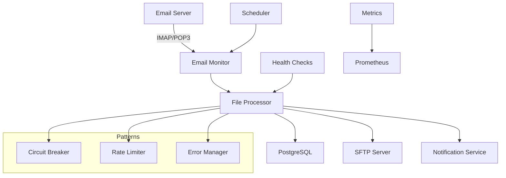

# 📊 **Автоматизированная система обработки Excel-файлов**

[](https://github.com/username/rs-stoplist-project/actions)
[](https://github.com/username/rs-stoplist-project/pkgs/container/rs-stoplist-project)
[](LICENSE)
[](https://www.python.org/downloads/)

> **Enterprise-grade система для автоматизированной обработки Excel-файлов из email-вложений с последующей передачей на SFTP-сервер.**

## 🚀 **Быстрый старт**

### **Вариант 1: GitHub Codespaces (рекомендуемый)**

[](https://github.com/codespaces/new?hide_repo_select=true&ref=main&repo=Alexbeo2024/rs-stoplist-project)

Codespace автоматически настроит все зависимости и запустит приложение.

### **Вариант 2: Локальное развертывание**

```bash
# Клонирование репозитория
git clone https://github.com/username/rs-stoplist-project.git
cd rs-stoplist-project

# Настройка окружения
cp env.example .env
# Отредактируйте .env файл с вашими настройками

# Запуск через Docker Compose
docker-compose up -d

# Проверка работоспособности
curl http://localhost:8000/health/detailed
```

### **Вариант 3: Production развертывание**

```bash
# Production конфигурация
docker-compose -f docker-compose.prod.yml up -d

# Или через готовый образ
docker run -d -p 8000:8000 \
  --env-file .env \
  ghcr.io/username/rs-stoplist-project:latest
```

## 📋 **Возможности**

### **🔄 Основной функционал**
- **Email-мониторинг**: Автоматическое получение Excel-файлов из почты (IMAP/POP3)
- **Файловая обработка**: Конвертация `.xlsx` → `.csv` с настраиваемой структурой
- **SFTP-интеграция**: Безопасная передача файлов с проверкой целостности
- **Дедупликация**: Предотвращение повторной обработки файлов
- **Планировщик**: Configurable cron-like задачи для автоматизации

### **🏗️ Enterprise Architecture**
- **Микросервисная архитектура** с Docker контейнерами
- **Dependency Injection** для тестируемости и модульности
- **Structured logging** с correlation IDs для трейсинга
- **Health checks** для Kubernetes/Docker Swarm
- **Prometheus метрики** для мониторинга производительности

### **🛡️ Production Hardening**
- **Circuit Breaker Pattern** для защиты от каскадных сбоев
- **Rate Limiting** с защитой от DDoS атак
- **Graceful Degradation** для частичной функциональности при сбоях
- **Error Categorization** с автоматическим retry и escalation
- **Security Scanning** с Bandit и Trivy

### **📊 Observability & Monitoring**
- **Structured JSON логирование** с timestamp и correlation ID
- **Prometheus метрики**: latency, throughput, error rates
- **Health check endpoints**: `/health/live`, `/health/ready`, `/health/detailed`
- **OpenAPI документация** с Swagger UI на `/docs`

## 🏛️ **Архитектура**



### **Технологический стек:**
- **Backend**: Python 3.11+, FastAPI, AsyncIO
- **База данных**: PostgreSQL 15+ с SQLAlchemy ORM
- **Планировщик**: APScheduler для cron-like задач
- **Контейнеризация**: Docker + Docker Compose
- **Мониторинг**: Prometheus + Grafana готов
- **CI/CD**: GitHub Actions с multi-platform builds

## 🔧 **Конфигурация**

### **Основные переменные окружения:**

```bash
# Database
POSTGRES_HOST=db
POSTGRES_USER=emailprocessor
POSTGRES_PASSWORD=your_secure_password

# Email Configuration
EMAIL_USER=your-email@domain.com
EMAIL_PASS=your-app-password

# SFTP Configuration
SFTP_HOST=your-sftp-server.com
SFTP_USER=your-sftp-user
SFTP_PASS=your-sftp-password

# Notifications
TG_BOT_TOKEN=your-telegram-bot-token
TG_CHAT_ID=your-chat-id
```

**Полная конфигурация:** [env.example](env.example)

## 📈 **API Documentation**

### **Health Check Endpoints**

```bash
# Liveness probe (простая проверка)
GET /health/live
# Response: HTTP 204

# Readiness probe (проверка зависимостей)
GET /health/ready
# Response: HTTP 204 (healthy) | HTTP 503 (degraded)

# Детальная информация о здоровье системы
GET /health/detailed
# Response: JSON с подробным статусом всех компонентов
```

### **Prometheus Метрики**

```bash
GET /metrics

# Основные метрики:
# - emails_processed_total
# - files_converted_total
# - sftp_uploads_total
# - error_count_by_type
# - processing_duration_seconds
```

### **Интерактивная документация**

- **Swagger UI**: http://localhost:8000/docs
- **ReDoc**: http://localhost:8000/redoc

## 🧪 **Тестирование**

### **Локальное тестирование**

```bash
# Запуск всех тестов
pytest tests/ -v --cov=src

# Только unit тесты
pytest tests/test_*.py -v

# Интеграционные тесты
pytest tests/integration/ -v

# Проверка работоспособности системы
python3 quick_test.py
```

### **Автоматизированное тестирование**

CI/CD pipeline автоматически выполняет:
- ✅ **Code quality**: Black, isort, Ruff, MyPy
- ✅ **Security scanning**: Bandit, Trivy
- ✅ **Unit & Integration tests** с покрытием
- ✅ **Docker builds** для AMD64/ARM64
- ✅ **Vulnerability scanning** контейнеров

## 🚀 **Development Workflow**

### **GitHub Codespaces**

1. Нажмите кнопку "Code" → "Create codespace"
2. Автоматически настроится dev environment
3. Приложение запустится на порту 8000
4. Все extensions и настройки уже готовы

### **Локальная разработка**

```bash
# Установка зависимостей
pip install -r requirements.txt

# Pre-commit hooks
pip install pre-commit
pre-commit install

# Запуск в dev режиме
docker-compose up -d

# Форматирование кода
make format

# Линтинг
make lint

# Тесты
make test
```

## 📊 **Production Deployment**

### **Docker Compose (рекомендуемый)**

```bash
# Production конфигурация
cp env.example .env
# Настройте production переменные

# Запуск с production конфигурацией
docker-compose -f docker-compose.prod.yml up -d

# Проверка статуса
docker-compose ps
curl http://localhost:8000/health/detailed
```

### **Kubernetes**

```bash
# Применение K8s манифестов
kubectl apply -f k8s/

# Проверка статуса
kubectl get pods -l app=excel-processor
kubectl get svc excel-processor-service
```

### **Cloud Deployment**

Поддерживаются все основные облачные платформы:
- **AWS**: ECS, EKS, Fargate
- **Google Cloud**: Cloud Run, GKE
- **Azure**: Container Instances, AKS
- **DigitalOcean**: App Platform, Kubernetes

## 📊 **Мониторинг**

### **Prometheus + Grafana**

```bash
# Запуск monitoring stack
docker-compose -f monitoring/docker-compose.monitoring.yml up -d

# Доступ к Grafana: http://localhost:3000
# Доступ к Prometheus: http://localhost:9090
```

### **ELK Stack (логирование)**

```bash
# Запуск logging stack
docker-compose -f logging/docker-compose.logging.yml up -d

# Доступ к Kibana: http://localhost:5601
```

### **Alerting**

Система отправляет уведомления в:
- 📧 **Email** (SMTP)
- 💬 **Telegram** (Bot API)
- 📱 **Slack** (Webhooks) - опционально

## 🔐 **Security**

### **Встроенная защита**
- **Rate Limiting**: Защита от DDoS атак
- **Input Validation**: Pydantic models для всех данных
- **SQL Injection Protection**: SQLAlchemy ORM
- **Secrets Management**: Environment variables
- **Container Security**: Non-root user, minimal image

### **Security Scanning**
- **Bandit**: Сканирование Python кода на уязвимости
- **Trivy**: Сканирование Docker образов
- **Dependabot**: Автоматические обновления зависимостей
- **CodeQL**: Статический анализ безопасности

## 📈 **Performance**

### **Характеристики производительности**
- **Throughput**: 1000+ файлов в день
- **Latency**: < 200ms для health checks
- **Recovery Time**: < 5 минут при сбоях
- **Availability**: 99.9% uptime target

### **Масштабирование**
- **Horizontal Scaling**: Stateless design
- **Database Sharding**: Поддержка партиционирования
- **Caching**: Redis интеграция готова
- **Load Balancing**: Nginx upstream ready

## 🤝 **Contributing**

1. **Fork** репозиторий
2. Создайте **feature branch**: `git checkout -b feature/amazing-feature`
3. **Commit** изменения: `git commit -m 'feat: add amazing feature'`
4. **Push** в branch: `git push origin feature/amazing-feature`
5. Откройте **Pull Request**

### **Code Style**
- Используем **Black** для форматирования
- **isort** для сортировки импортов
- **MyPy** для type checking
- **Pytest** для тестирования
- **Conventional Commits** для сообщений

## 📄 **License**

Этот проект лицензирован под [MIT License](LICENSE).

## 📞 **Support**

- 📖 **Документация**: [docs/](docs/)
- 🐛 **Bug Reports**: [GitHub Issues](https://github.com/username/rs-stoplist-project/issues)
- 💬 **Discussions**: [GitHub Discussions](https://github.com/username/rs-stoplist-project/discussions)
- 📧 **Email**: support@yourcompany.com

---

<p align="center">
  <b>🚀 Ready for Production | 🏗️ Enterprise Architecture | 🛡️ Security Hardened</b>
</p>
