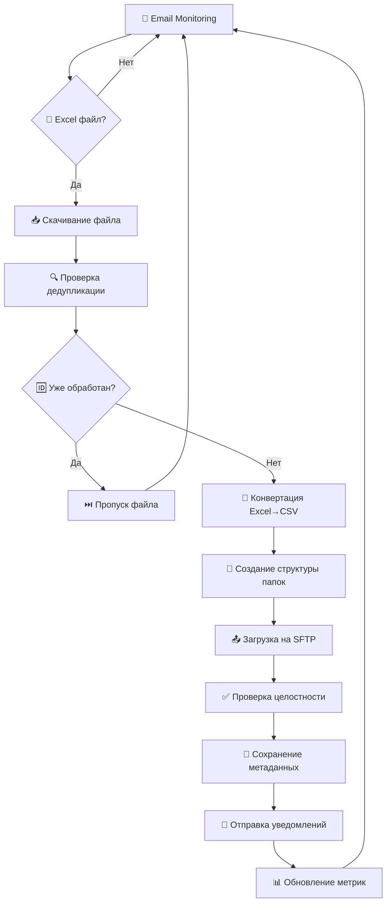
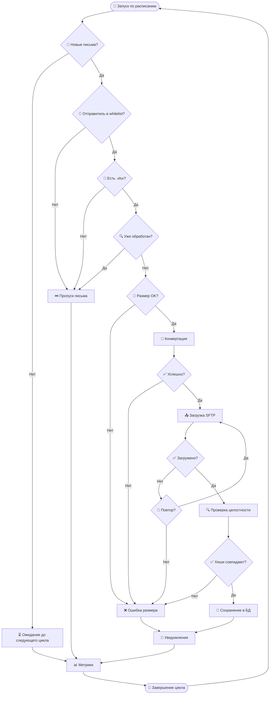

# 🔄 **БИЗНЕС-ПРОЦЕСС АВТОМАТИЗИРОВАННОЙ СИСТЕМЫ**

*Подробное описание рабочего процесса обработки Excel-файлов из email вложений*

---

## 📋 **ОБЗОР ПРОЦЕССА**

Система автоматически мониторит корпоративную почту, извлекает Excel-файлы из вложений, конвертирует их в CSV формат и загружает на SFTP сервер с уведомлением заинтересованных сторон.

**Входные данные:** Email с Excel вложениями (.xlsx)
**Выходные данные:** CSV файлы на SFTP сервере в структурированных папках
**Периодичность:** Каждый час (настраивается)
**Надежность:** Retry логика, дедупликация, проверка целостности

---

## 🎯 **ЦЕЛИ И ЗАДАЧИ**

### **Основные цели:**
- **Автоматизация** ручного процесса обработки Excel файлов
- **Стандартизация** формата данных (CSV с UTF-8 BOM)
- **Централизация** хранения обработанных файлов
- **Мониторинг** и уведомления о статусе обработки

### **Решаемые задачи:**
- Исключение человеческого фактора
- Сокращение времени обработки
- Обеспечение аудита и трассировки
- Интеграция с существующими системами

---

## 🔄 **ПОЛНЫЙ ЖИЗНЕННЫЙ ЦИКЛ**



---

## 📧 **ШАГ 1: EMAIL МОНИТОРИНГ**

### **Процесс:**
1. **Подключение к IMAP серверу** каждый час (по расписанию)
2. **Проверка новых писем** в указанном почтовом ящике
3. **Фильтрация по whitelist** отправителей
4. **Поиск вложений** с расширением `.xlsx`

### **Технические детали:**
```python
# Псевдокод процесса
async def monitor_emails():
    async with IMAPClient(config.email.server) as client:
        await client.login(config.email.username, config.email.password)

        # Поиск новых писем
        new_emails = await client.search_new_emails()

        for email in new_emails:
            if email.sender in config.allowed_senders:
                for attachment in email.attachments:
                    if attachment.filename.endswith('.xlsx'):
                        yield EmailWithAttachment(email, attachment)
```

### **Критерии отбора:**
- **Отправитель** в whitelist (config.yaml)
- **Наличие .xlsx вложений**
- **Письмо не обработано ранее** (по Message-ID)

### **Обработка ошибок:**
- Таймауты подключения → Retry через 5 минут
- Неверные учетные данные → Критическое уведомление
- Сетевые сбои → Exponential backoff

---

## 🔍 **ШАГ 2: ДЕДУПЛИКАЦИЯ И ВАЛИДАЦИЯ**

### **Проверка дедупликации:**
```sql
-- Проверка по Message-ID
SELECT COUNT(*) FROM processed_files
WHERE message_id = '${email.message_id}'
  AND file_name = '${attachment.filename}'
```

### **Валидация файла:**
- **Размер файла** < 50MB (настраивается)
- **Формат файла** действительно Excel (.xlsx)
- **Файл не поврежден** (возможность открытия)

### **Логика принятия решений:**
```python
if file_already_processed(message_id, filename):
    log_info("File already processed, skipping")
    send_metrics("file_skipped_duplicate")
    continue

if not validate_excel_file(file_content):
    log_error("Invalid Excel file")
    send_alert("Invalid file received")
    continue

# Продолжаем обработку
```

---

## 🔄 **ШАГ 3: КОНВЕРТАЦИЯ EXCEL → CSV**

### **Процесс конвертации:**
1. **Загрузка Excel файла** в память
2. **Чтение активного листа** (или первого листа)
3. **Конвертация в CSV** с настройками:
   - Кодировка: `UTF-8 with BOM`
   - Разделитель: `,` (запятая)
   - Кавычки: По необходимости
4. **Генерация имени файла**: `RS_stoplist_{YYYYMMDD}.csv`

### **Технические детали:**
```python
import pandas as pd
from datetime import datetime

def convert_excel_to_csv(excel_content: bytes, email_date: datetime) -> str:
    # Загружаем Excel
    df = pd.read_excel(excel_content, engine='openpyxl')

    # Форматируем имя файла
    date_str = email_date.strftime('%Y%m%d')
    csv_filename = f"RS_stoplist_{date_str}.csv"

    # Сохраняем CSV
    df.to_csv(
        csv_filename,
        encoding='utf-8-sig',  # UTF-8 with BOM
        sep=',',
        index=False,
        quoting=csv.QUOTE_MINIMAL
    )

    return csv_filename
```

### **Обработка данных:**
- **Автоматическое определение** типов данных
- **Сохранение формул** как значений
- **Обработка специальных символов**
- **Валидация результата** конвертации

---

## 📁 **ШАГ 4: СОЗДАНИЕ СТРУКТУРЫ ПАПОК**

### **Иерархия папок:**
```
/upload/excel-files/
├── ps/
│   └── 2024/
│       └── 01/
│           └── 15/
│               └── RS_stoplist_20240115.csv
│               └── RS_stoplist_20240115.csv.meta
├── logs/
│   ├── success/
│   │   └── 2024-01-15-processing.log
│   └── errors/
│       └── 2024-01-15-errors.log
└── archive/
    └── 2024/
        └── 01/
            └── original_files/
```

### **Логика создания папок:**
```python
def build_remote_path(email_date: datetime) -> str:
    year = email_date.year
    month = f"{email_date.month:02d}"
    day = f"{email_date.day:02d}"

    # Структура: ps/YYYY/MM/DD/
    return f"ps/{year}/{month}/{day}/"
```

### **Метаданные файла:**
Вместе с CSV создается метафайл `.meta`:
```json
{
    "original_filename": "report_2024.xlsx",
    "processed_date": "2024-01-15T10:30:00Z",
    "email_sender": "reports@company.com",
    "email_date": "2024-01-15T09:00:00Z",
    "file_size_bytes": 15342,
    "rows_count": 1250,
    "md5_hash": "a1b2c3d4e5f6...",
    "processing_duration_ms": 1250
}
```

---

## 📤 **ШАГ 5: ЗАГРУЗКА НА SFTP СЕРВЕР**

### **Процесс загрузки:**
1. **Установка SFTP соединения** (SSH ключ или пароль)
2. **Создание необходимых папок** на удаленном сервере
3. **Загрузка CSV файла** в целевую папку
4. **Загрузка метафайла** рядом с CSV
5. **Проверка целостности** (сравнение хешей)

### **Retry логика:**
```python
async def upload_with_retry(file_path: str, remote_path: str, max_retries: int = 3):
    for attempt in range(max_retries):
        try:
            success = await sftp_client.upload(file_path, remote_path)
            if success and await verify_upload(file_path, remote_path):
                return True
        except Exception as e:
            delay = 2 ** attempt  # Exponential backoff
            await asyncio.sleep(delay)
            log_warning(f"Upload attempt {attempt + 1} failed: {e}")

    return False
```

### **Проверка целостности:**
- **MD5 хеш** локального файла
- **MD5 хеш** загруженного файла
- **Сравнение размеров** файлов
- **Проверка прав доступа** на удаленном файле

---

## 💾 **ШАГ 6: СОХРАНЕНИЕ МЕТАДАННЫХ В БД**

### **Структура данных:**
```sql
-- Таблица обработанных файлов
INSERT INTO processed_files (
    message_id,
    sender_email,
    file_name,
    file_path,
    csv_path,
    sftp_uploaded,
    file_hash,
    processed_at,
    email_date,
    processing_duration_ms,
    file_size_bytes,
    rows_count
) VALUES (
    '${email.message_id}',
    '${email.sender}',
    '${original_filename}',
    '${local_path}',
    '${remote_path}',
    true,
    '${md5_hash}',
    NOW(),
    '${email.date}',
    ${duration},
    ${file_size},
    ${rows}
);
```

### **Логирование операций:**
```sql
-- Лог операций
INSERT INTO operation_logs (
    operation_type,
    status,
    message,
    context,
    created_at
) VALUES (
    'file_processing',
    'SUCCESS',
    'File processed successfully',
    '{"file": "RS_stoplist_20240115.csv", "duration": 1250}',
    NOW()
);
```

---

## 📨 **ШАГ 7: СИСТЕМА УВЕДОМЛЕНИЙ**

### **Типы уведомлений:**

#### **✅ SUCCESS (Успех):**
```
📊 ОБРАБОТКА ФАЙЛА ЗАВЕРШЕНА

Файл: RS_stoplist_20240115.csv
Источник: reports@company.com
Время обработки: 1.25 сек
Строк данных: 1,250
Размер: 15.3 KB
SFTP путь: ps/2024/01/15/RS_stoplist_20240115.csv

✅ Загрузка на SFTP: Успешно
✅ Проверка целостности: Пройдена
✅ Метаданные: Сохранены
```

#### **❌ ERROR (Ошибка):**
```
🚨 ОШИБКА ОБРАБОТКИ ФАЙЛА

Файл: corrupted_report.xlsx
Источник: reports@company.com
Ошибка: Не удалось открыть Excel файл
Время: 2024-01-15 10:30:00

❌ Конвертация: Провалена
⚠️ Файл перемещен в карантин
📞 Требуется вмешательство администратора
```

#### **⚠️ WARNING (Предупреждение):**
```
⚠️ НЕСТАНДАРТНАЯ СИТУАЦИЯ

Файл: large_report.xlsx
Размер: 48.5 MB (близко к лимиту 50 MB)
Обработка: Успешна, но с задержкой
Время обработки: 12.5 сек (выше нормы)

💡 Рекомендация: Оптимизировать размер исходных файлов
```

### **Каналы доставки:**
1. **Email** → Администраторы и операционная команда
2. **Telegram** (опционально) → Для оперативных уведомлений

---

## 📊 **ШАГ 8: МОНИТОРИНГ И МЕТРИКИ**

### **Собираемые метрики:**
```python
# Prometheus метрики
emails_processed_total = Counter('emails_processed_total')
files_converted_total = Counter('files_converted_total')
sftp_uploads_total = Counter('sftp_uploads_total')
processing_duration_seconds = Histogram('processing_duration_seconds')
errors_by_type = Counter('errors_by_type', ['error_type'])
file_size_bytes = Histogram('file_size_bytes')
```

### **Health Checks:**
- **/health/live** → Приложение запущено
- **/health/ready** → Готово к обработке (БД, SFTP доступны)
- **/health/detailed** → Подробная информация о компонентах

---

## ⚙️ **КОНФИГУРАЦИЯ И НАСТРОЙКИ**

### **Параметры планировщика:**
```yaml
scheduler:
  interval_hours: 1           # Интервал проверки почты
  timezone: "UTC"             # Временная зона
  max_concurrent_jobs: 1      # Одновременных задач
  misfire_grace_time: 300     # Время ожидания пропущенных задач
```

### **Параметры обработки файлов:**
```yaml
file_processing:
  max_file_size_mb: 50        # Максимальный размер файла
  temp_directory: "/tmp"      # Временная директория
  csv_encoding: "utf-8-sig"   # Кодировка CSV
  csv_separator: ","          # Разделитель CSV
  cleanup_temp_files: true    # Удалять временные файлы
```

---

## 🔄 **FLOW ДИАГРАММА ПРИНЯТИЯ РЕШЕНИЙ**



---

## 🎛️ **РЕЖИМЫ РАБОТЫ**

### **🟢 Нормальный режим:**
- Обработка по расписанию каждый час
- Все компоненты работают штатно
- Уведомления только о важных событиях

### **🟡 Режим восстановления:**
- После сбоев или длительного простоя
- Обработка накопившихся писем
- Увеличенная частота проверок
- Дополнительные уведомления

### **🔴 Режим технического обслуживания:**
- Планово отключенная обработка
- Только мониторинг и health checks
- Уведомления о режиме обслуживания

### **🟠 Аварийный режим:**
- При критических ошибках
- Минимальная функциональность
- Максимальное логирование
- Немедленные уведомления администраторов

---

## 📈 **КЛЮЧЕВЫЕ ПОКАЗАТЕЛИ ЭФФЕКТИВНОСТИ (KPI)**

### **Операционные метрики:**
- **Время обработки файла**: < 5 секунд (норма)
- **Успешность загрузки**: > 99.5%
- **Доступность системы**: > 99.9%
- **Время восстановления**: < 5 минут

### **Бизнес-метрики:**
- **Количество обработанных файлов в день**: Цель
- **Экономия времени**: vs ручная обработка
- **Снижение ошибок**: vs ручной процесс
- **Удовлетворенность пользователей**: Опросы

---

## 🚨 **ОБРАБОТКА ИСКЛЮЧИТЕЛЬНЫХ СИТУАЦИЙ**

### **Сценарии и реакции:**

| Ситуация | Реакция системы | Уведомления |
|----------|-----------------|-------------|
| SFTP недоступен | Сохранение локально + retry | WARNING → CRITICAL |
| БД недоступна | Файловое логирование | CRITICAL |
| Поврежденный Excel | Перемещение в карантин | ERROR |
| Переполнение диска | Очистка временных файлов | WARNING |
| Сетевые сбои | Exponential backoff | WARNING |
| Превышение лимитов | Throttling + уведомление | WARNING |

---

## 🔧 **ТЕХНИЧЕСКОЕ ОБСЛУЖИВАНИЕ**

### **Регулярные задачи:**
- **Ежедневно**: Проверка логов и метрик
- **Еженедельно**: Очистка старых временных файлов
- **Ежемесячно**: Архивация старых записей БД
- **Ежеквартально**: Обновление SSL сертификатов

### **Мониторинг состояния:**
- **CPU/Memory**: Использование ресурсов
- **Disk Space**: Свободное место
- **Network**: Сетевая доступность
- **Dependencies**: Статус внешних сервисов

Этот бизнес-процесс обеспечивает надежную, масштабируемую и прозрачную автоматизацию обработки Excel-файлов с полным аудитом и мониторингом каждого этапа.
